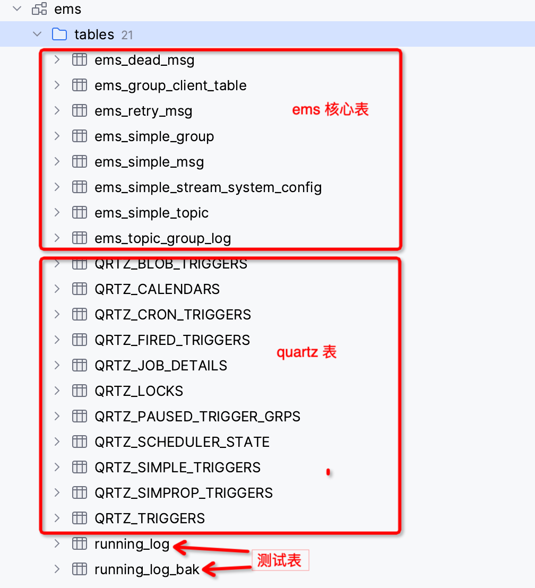
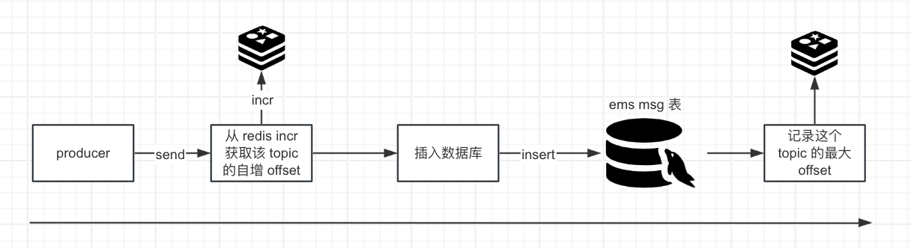
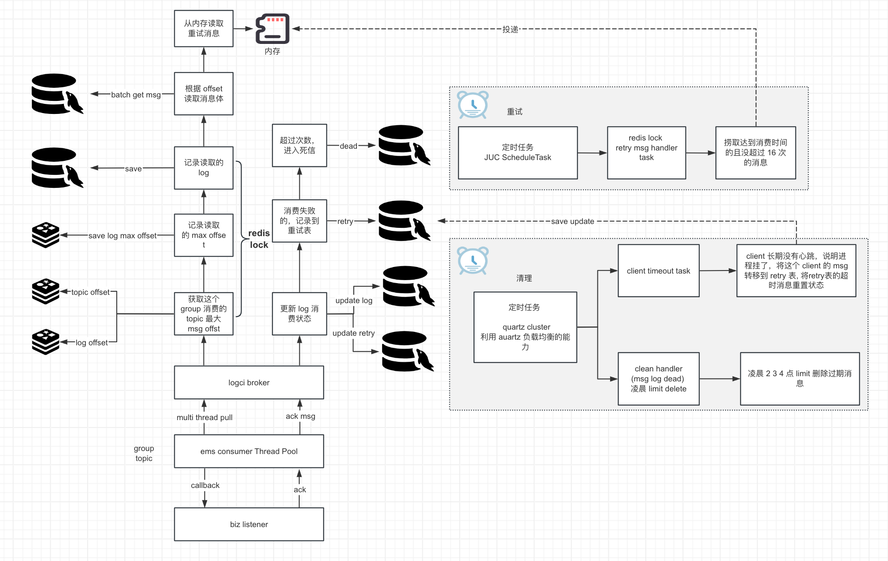

## EMS

Extension MySQL Stream； 扩展 MySQL 队列.

为了减轻某些小型应用的搭建成本, 实现一种基于 MySQL 实现的 stream 队列. 

## 功能

1. 集群消费、广播消费
2. 自动重试、死信队列
3. 快速重置消息位点，快速回放消息,快速查询消息
4. 消息可基于磁盘积压、消息可快速清理
5. 监控 group 积压，topic 消息量排行，消息链路追踪(发送线程, 消费线程)，消息消费超时告警；
6. 天生支持和业务绑定的事务特性


## springboot 2.x 接入

环境准备:
1. mysql 8.x version
2. redis x version
3. JDK8
4. maven


#### Maven:

```xml
<dependency>
    <groupId>com.github.colosobo.base.ems</groupId>
    <artifactId>ems-springboot2-openSource-starter</artifactId>
    <version>1.0.0-SNAPSHOT</version>
</dependency>
```

#### SpringBoot 配置, 包含  ems  数据库配置, redis 配置等
```yml
spring:
  datasource:
    ems:
      url: jdbc:mysql://localhost:3306/ems
      username: root
      password: {}
      driverClassName: com.mysql.cj.jdbc.Driver
      druid:
        max-active: 300
    url: jdbc:mysql://localhost:3306/ems_test
    username: root
    password: {}
    driverClassName: com.mysql.cj.jdbc.Driver
    druid:
      max-active: 300
ems:
  enabled: true
  redisson:
    url: redis://localhost:6379
```

#### 执行 Sql Init -->> [init.sql](init.sql)




#### Producer: 参见 [springboot-producer-1](example-parent%2Fspringboot-producer-1)

```text
SimpleProducer producer = new SimpleProducerImpl();
producer.start();
SendResult sendResult = producer.send(Msg.builder().topic("TopicA").body("hello-world").build());
System.out.println(sendResult.getMsgId());
```

#### Consumer: 参见 [springboot-consumer-1](example-parent%2Fspringboot-consumer-1)

```text
SimpleConsumer consumer = new SimpleConsumerImpl(group, topic, 20, GroupType.CLUSTER);
consumer.register(msgList -> {
    for (Msg msg : msgList) {
        System.out.println(msg.getMsgId());
    }
    return ConsumerResult.success();
});
consumer.start();
```

## 写入设计

msg id 就是 topic 维度的自增 id，可对多个 topic 并发写入

- 针对一个 topic，需要有物理 physics offset， 每次写入，topic 维度的 physics_offset 自增加一
    - 写入需要上锁吗? 看怎么写, 如果使用非原子的形式自增 id,比如数据的的方式,先查出最大 id,再加一,那么必须加锁
        - 如果使用 redis 自增特性实现, 为每个 topic 配置一个自增 key, 则可以避免加锁.
        - redis 实现虽然性能好, 如为配置aof,宕机则可能导致丢失数据, 此时,会出现 offset 重复异常, 过一会随着继续自增,
          也就恢复了.
    - topic 维度的自增 id 如果使用 mysql 实现， 性能不堪受辱，因此，此处使用 redis 自增实现（可配置为 mysql 实现）；
    - 经过测试，笔记本电脑，单 topic 20 并发写入，qps 在 1000-1500 左右（local mysql & local redis），基本满足业务需求。
    - 考虑到高可用性和业务场景，此处无法使用批量插入
- 所有的 topic 和 msg 都写入的这一张表中，表数据使用 quartz 定时凌晨清理，消费完的消息，可提前删除。
- 写入流程如下图: 



## 读取设计

1. 假设针对一个 topic，只有一个 consumer，只需循环读取，然后更新 offset 即可。
    1. 但结合实际业务场景，这种基本不存在，所以，忽略这种场景。
    2. 通常，一个 topic 有多个 consumer group（简称 tg）， 一个 consumer group 有多个 client（jvm or thread）
2. 如果一个 topic + group（简称 tg），有多个 consumer，每个 consumer 有多个线程，读取和更新 offset 则会有并发问题.

- 这个 client id，我们将其设计为，ip + pid + uuid；
    - ip 和 pid 可帮助我们追溯问题
    - uuid 简单防重复
- 结合实际业务场景，且遵循 simple is better 原则，读取时，使用上锁的方式解决并发问题。锁的粒度就是 tg
- 考虑到要实现基本的顺序读取和防止重复消费，多线程并发时，我们应当实现基于自增的形式读取 msg；每个 client id
  读取消息后，都会记录一个简单的log，并在 tg 维度增加一个 max offset
- 每次读取消息时，每个 client 都需要去检查当前想要读取的 tg 是否已经有【其他 client】在操作 max offset。即，我们将锁的粒度缩小到了
  max offset；
    - 整体原则是，一个 t + g 的 max offset，同时只能有一个 thread 操作（写和更新）
    - 如果有其他人在读取，则阻塞
    - 如果没有其他人在读取，则锁住这个 tg， 并批量拉取一定数量的消息 id，
        - 对这个 tg 维度的 max offset + n
        - 批量插入这个 tg + clientid offset log，表明这个消息被这个 clientid 读取了，同时也间接更新了 max offset（order by
          offset）
        - 释放锁🔐
        - 拉取刚刚读取的 msg id list 里面的消息体
        - 交给业务处理消息



3. ack
    1. 对于集群消息，如何保证在断电情况下，消息不丢失,使用数据库存储消息, 写入即不会丢失, 但消费时,
       如果刚刚读进内存就立刻宕机,则需要在重启时恢复消息.
    2. 每个 client get 到消息后，都需要记录 msg pid，consumer group，state（start、done，retry）为 start 状态
    3. ack success，将 log update 为 done 状态
    4. ack fail 后，将 log update 为 retry 状态，同时将消息存入重试队列
        1. 这里需要上锁吗？其实是不需要的，因为更新的维度是 client id 的 log，不存在并发更新.
           这里更新状态是表示这些消息已经处理结束了，否则无法判定宕机场景。
        2. 对于 start 状态的消息，定时任务会去检查
            1. 如果 client 还存活，超过 1 分钟(可配)，则将其捞出，放进重试队列，并在 10s 进行第一次重试
            2. 如果 client 还存活，则立刻将其捞出，放进重试队列，并在 10s 进行第一次重试
    5. ack 是批量的，ack 失败，仅会导致重复消费。

4. 广播消息
    1. 是否为广播消息由 topic 确定
    2. 广播消息不需要上锁，每一个订阅该 topic 的 client 都会读取到该消息
    3. 广播消息不需要 ack，不需要记录成功或失败或重试，仅需要内存里和磁盘中记录 offset, 如果没有历史记录, 则读取最新的记录.
    4. 推荐尽可能使用集群模式，使用集群模式模拟广播模式


5. client id
    1. 只有 consumer 需要 client id
    2. client id 由 ip pid uuid 组成
    3. client id 需要续约（5s），如果机器宕机，则会被自动清除，且他的 start 状态的消息会进入重试队列，交给同 group 的其他
       client
    4. client id 可以自己主动注销，注销前，自己内存的消息应当被优雅消费结束，一般来讲，kill -15 的 jvm 都会主动注销 client
       id；

## 核心表设计

1. topic 表：记录 topic 元信息
2. group 表：记录 group 订阅元信息
3. msg 表：msg总表，记录写入的信息，包含 body 和 topic 维度的自增 offset，类似 rocketmq commit log
    1. 该表会被多个 consumer 消费的消息
    2. 该表会被定制删除过期数据
4. retry msg 表，消费失败、超时的消息，会进入该表，并按阶梯定时消费
5. dead msg 表，消费重试 16（any config） 次的消息，会进入该表
6. topic_group_log 表：记录 consumer group client 的 msg 消费记录，包含 state（start、done，retry） 字段，可 ack
    1. 该表的记录行数会非常多，单行数据较少，可自动删除 done 的记录

## 锁🔐

如上文所说，由于本方案未采用常见的多 queue 和多 partition 的设计，因此瓶颈在于上图提到的分布式锁的设计上，具体链路为
consumer group client 在集群消费时，
为了让并发读取的 thread 拉取到的消息尽可能准确，使用上锁的方式来实现。

总体看下来, 可以简单理解为, ems 失去了性能, 却拥有了所有.

## 测试

分布式程序的测试较为复杂; 下面将介绍 ems 如何重复快速的执行集成测试用例来验证本程序的正确性.

参见: com.think.ems.dispatcher.Main

### 目标：

1. 一致性测试
    - 多 topic 并发写入
    - 多 group 并发消费
    - kill -9 group 实例测试；
    - 紧急情况下，truncate msg 表，是否造成系统不可用；
    - redis 宕机，自增 id 是否继续可用。
    - 消费返回 false 时，消费次数是否符合预期
2. 性能测试
    - 数据大小 1kb，10kb，100kb，1000kb
    - 生产者并发写入 QPS
    - 消费者并发读取 QPS

### 测试背景

1. mysql 8.0 本地
2. redis 7.0 本地
3. msg 数据白天不进行 delete；
4. 凌晨 delete

3. 业务逻辑为空跑循环

### Topic

1. topicA
2. topicB

### Group

1. Group1 ----> topicA
2. Group2 ----> topicB
3. Group3 ----> topicB

### Producer

1. 实例 P1
    - 向 topicA 发送消息
    - 发送 5w 条
2. 实例 P2
    - 向 topicA 发送 5W 消息
    - 向 topicB 发送 5W 消息

### Consumer

1. 实例 C1
    - Group1
2. 实例 C2
    - Group2
3. 实例 C3
    - Group1
    - Group3

### 预期

并发启动 5 个 JVM; 2个生产者, 3个消费者;

- P1 发送 5w, P2 发送 10w; 共计 15w 消息;
- 3 个消费者, 预期消费记录 20W

------

1. JVM P1 发送完毕消息
2. JVM P2 发送完毕消息
3. 消息表总数
    - topicA：10w
    - topicB：5w
4. Group1 消费 10w topicA
5. Group2 消费 5w topicB
6. Group3 消费 5w topicB
7. JVM C1 （Group1）
    - 消费 5w左右 topicA(10w 以内)
8. JVM C2 （Group2）
    - 消费 5w topicB
9. JVM C3（Group1 Group3）
    - 消费 5w左右 Group1 ----> topicA；
    - 消费 5w Group3 ----> topicB

-----

## Sentinel QPS 统计

3 个 consumer 实例

```text
1695618221000|2023-09-25 13:03:41|Group|2776|0|2776|0|0|0|0|0
1695618221000|2023-09-25 13:03:41|Group|529|0|530|0|20|0|0|0
1695618221000|2023-09-25 13:03:41|Group|2111|0|2109|0|7|0|0|0

消费 QPS：5416
```

2 个 producer 实例

```text
1695618214000|2023-09-25 13:03:34|send|5381|0|5381|0|0|0|0|0
1695618214000|2023-09-25 13:03:34|send|10521|0|10521|0|0|0|0|0

生产 QPS：15902
```

- MySQL 8.0 : 本机
- Redis 7.0 : 本机
- 测试机器: AMD 7950x + DDR5 64G(5600) + SSD(7200)

## 生产者可靠性测试

考虑到写入可靠性以来 MySQL, 这里默认 MySQL 是高可靠的. 不再做可靠性测试;

## 消费者可靠性测试

shell 逻辑

1. 启动 2 个 producer
    - 并发向 topic 发送数据
2. 启动 3 个 consumer
    - 并发消费
3. 启动 5 个 jvm 实例后, 随机 kill -9 某个 consumer
4. 3 秒后启动这个被 kill 的 consumer;
5. 程序验证数据库数据是否符合预期(有唯一索引限制)

逻辑参见: [auto_kill_recover.sh](auto_kill_recover.sh)

## 广播消息

- 每条消息都需要被相同逻辑的多台机器处理。
- 广播模式下，消息队列保证每条消息至少被每台客户端消费一次，但是并不会对消费失败的消息进行失败重投，因此业务方需要关注消费失败的情况。
- 广播模式下，客户端每一次重启都会从最新消息消费。 客户端在被停止期间发送至服务端的消息将会被自动跳过，请谨慎选择。
- 广播模式下，每条消息都会被大量的客户端重复处理， 因此推荐尽可能使用集群模式。
- 广播模式下, 数据库不维护消费进度
- 消费进度在客户端维护， 出现消息重复消费的概率稍大于集群模式。

广播消息的定义与 rocketmq 一致, 基于 consumer group 定义.

使用参见:

1. [springboot-broadcast-test-producer](example-parent%2Fspringboot-broadcast-test-producer)

- 广播消息生产者

2. [springboot-broadcast-test-1](example-parent%2Fspringboot-broadcast-test-1)

- 广播消息消费者 1

3. [springboot-broadcast-test-2](example-parent%2Fspringboot-broadcast-test-2)

- 广播消息消费者 2

## 参数

ems 参数控制在数据库 ems_simple_stream_system_config 表和 cn.think.github.simple.stream.api.EmsSystemConfig 接口中,
支持以下配置:

1. autoCreateTopic

- 是否自动创建 topic
- 默认 true

2. msgMaxSizeInBytes

- 消息最大长度
- 默认 4MB (4210688)

3. consumerBatchSize

- consumer 一次批量拉去的消息数
- 默认 10

4. consumerThreads

- 指定 consumer 并发线程数
- 默认 5

5. consumerRetryMaxTimes

- 指定 consumer 重试次数
- 默认 15


## 性能测试记录

- 4c 16g  CPU MHz:               2095.078
- mysql + redis + jvm*5(2p+3c) (100 qps 指的是 1kb 消息体每秒发送 100 次, 另读取的 qps 为 150, 总 qps 为 250)
1. qps 5:  cpu 8%~13%
2. qps 10: 10% - 15%
3. qps 50: 22% - 30%
4. qps 100: 22% - 30%
5. qps 200: 29% - 36%
6. qps 400: 36% - 55% (%idle 33.71)
